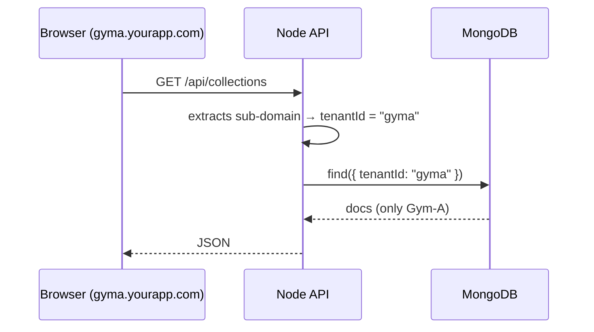

# Multi-Tenant Upgrade – Simple Overview

---

## Why do we need it?
* Sell **one app** to **many customers** (Gyms, Studios, Coaches)
* Each customer sees **only their own data**
* Cheaper than running five copies of the server

---

## What will actually change?
1. **Tenant list** – table of customers in the database
2. Every record (user, workout, order …) gets a new column
   ```text
   tenantId  ←  points at the customer it belongs to
   ```
3. The server reads the **sub-domain** (e.g. `gyma.yourapp.com`) to know which tenant is asking.
4. Every database query automatically filters by that `tenantId`.

---

## How a request flows now


---

## Steps (high level)
1. **Add tenant table** (5 mins)
2. **Add tenantId field** to all models (2 hrs)
3. **Tenant middleware** – finds tenant from sub-domain (15 mins)
4. **Plugin** – injects tenantId into all queries (20 mins)
5. **Backfill script** – tag old data with correct tenantId (1 hr)
6. **Deploy** and point customer domains (`gyma.yourapp.com`, `gymb.yourapp.com`)

Total work ≈ **1 day** for basic version; one week for production-ready rollout.

---

## What stays the same?
* React front-end – only the base URL changes
* Existing controllers – keep their logic, just inherit the tenant filter
* Hosting on Vercel + MongoDB Atlas

---

### After the upgrade
* Onboard a new customer = insert one row + set up DNS
* All customers share the same code updates automatically
* You can point **any custom domain** (`gym-alpha.com`) to the same app; middleware matches it to the right tenant.

_That's it — multi-tenant in a nutshell!_ 