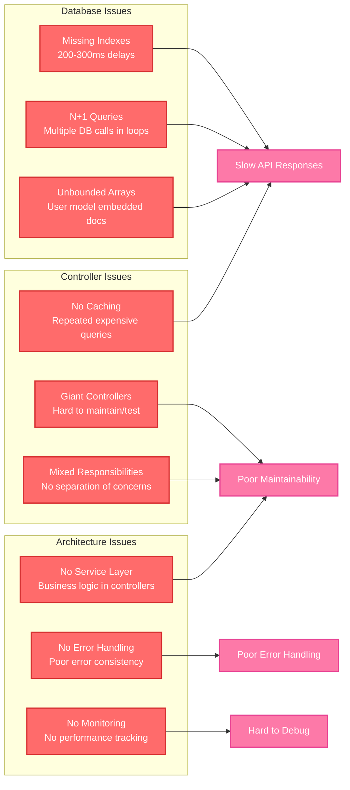
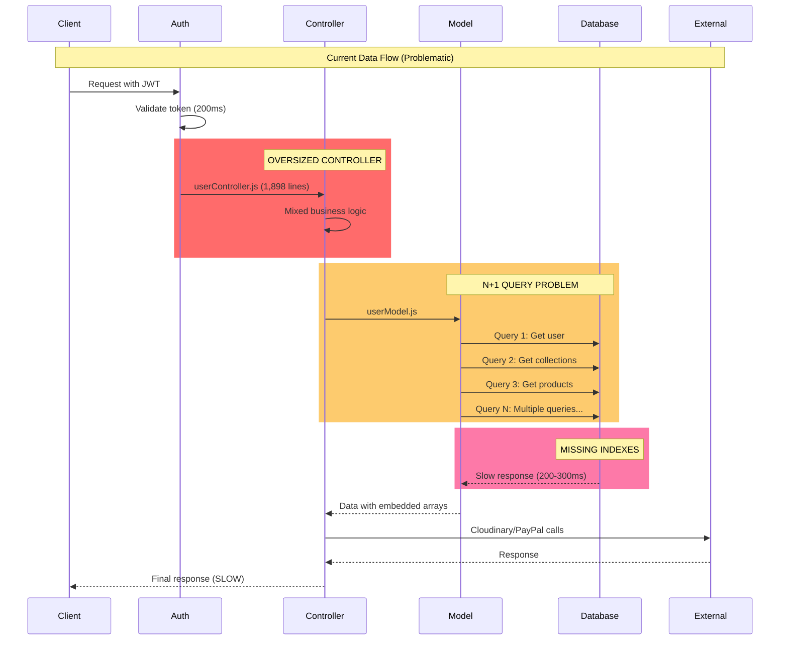
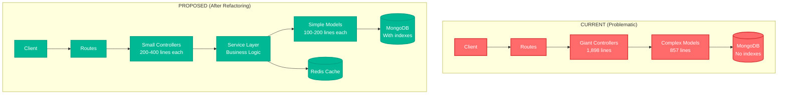

# SYSTEM ARCHITECTURE DIAGRAM

## OVERVIEW
This diagram shows the complete GrindX backend architecture including all components, layers, and their interactions.

## CURRENT SYSTEM ARCHITECTURE

```mermaid
graph TB
    subgraph "Client Layer"
        FE[Frontend React App]
        MOBILE[Mobile App]
        ADMIN[Admin Dashboard]
    end

    subgraph "API Gateway & Load Balancer"
        LB[Load Balancer]
        CORS[CORS Middleware]
        AUTH[Auth Middleware]
    end

    subgraph "Express.js Application Layer"
        SERVER[server.js<br/>Main Express Server]
        
        subgraph "Route Layer"
            UR[User Routes<br/>25 endpoints]
            CR[Collection Routes<br/>15 endpoints]
            PR[Product Routes<br/>12 endpoints]
            OR[Order Routes<br/>10 endpoints]
            OTC[OneTimeCode Routes<br/>8 endpoints]
            MT[MessageTemplate Routes<br/>6 endpoints]
            WE[WorkoutEntry Routes<br/>5 endpoints]
            SS[SystemSettings Routes<br/>4 endpoints]
            UP[Upload Routes<br/>3 endpoints]
        end

        subgraph "Controller Layer - OVERSIZED FILES"
            UC[userController.js<br/>1,898 LINES<br/>⚠️ CRITICAL ISSUE]
            CC[collectionController.js<br/>1,074 LINES<br/>⚠️ NEEDS SPLIT]
            OTCC[oneTimeCodeController.js<br/>480 lines]
            PC[productController.js<br/>~300 lines]
            OC[orderController.js<br/>~250 lines]
            MTC[messageTemplateController.js<br/>~200 lines]
            WEC[workoutEntryController.js<br/>~150 lines]
            SSC[systemSettingsController.js<br/>~100 lines]
            UPC[uploadController.js<br/>~100 lines]
        end

        subgraph "Middleware Layer"
            AH[asyncHandler.js]
            AM[authMiddleware.js]
            EM[errorMiddleware.js]
            VM[validationMiddleware.js]
        end

        subgraph "Business Logic Layer - MISSING"
            SERV[❌ NO SERVICE LAYER<br/>Business logic mixed in controllers]
        end

        subgraph "Model Layer"
            UM[userModel.js<br/>857 LINES<br/>⚠️ COMPLEX SCHEMA]
            CM[collectionModel.js<br/>73 lines ✓]
            OTCM[oneTimeCodeModel.js<br/>101 lines ✓]
            PM[productModel.js<br/>~80 lines]
            OM[orderModel.js<br/>~90 lines]
            MTM[messageTemplateModel.js<br/>~60 lines]
            WEM[workoutEntryModel.js<br/>~70 lines]
            SSM[systemSettingsModel.js<br/>~40 lines]
        end

        subgraph "Utility Layer"
            GT[generateToken.js]
            CP[calcPrices.js]
            CG[collectionGenerator.js]
            IMG[imageUpload.js]
        end
    end

    subgraph "Database Layer"
        MONGO[(MongoDB Atlas<br/>Primary Database)]
        REDIS[(❌ NO CACHE<br/>Missing Redis)]
    end

    subgraph "External Services"
        CLOUD[Cloudinary<br/>Image Storage]
        PAYPAL[PayPal<br/>Payment Processing]
        WA[WhatsApp Business API<br/>Messaging]
        EMAIL[❌ NO EMAIL SERVICE<br/>Missing SMTP]
    end

    subgraph "Deployment & Infrastructure"
        VERCEL[Vercel<br/>Serverless Deployment]
        ENV[Environment Variables<br/>.env Configuration]
        LOGS[❌ NO LOGGING<br/>Missing Monitoring]
    end

    %% Client connections
    FE --> LB
    MOBILE --> LB
    ADMIN --> LB

    %% Load balancer to middleware
    LB --> CORS
    CORS --> AUTH
    AUTH --> SERVER

    %% Server to routes
    SERVER --> UR
    SERVER --> CR
    SERVER --> PR
    SERVER --> OR
    SERVER --> OTC
    SERVER --> MT
    SERVER --> WE
    SERVER --> SS
    SERVER --> UP

    %% Routes to controllers
    UR --> UC
    CR --> CC
    PR --> PC
    OR --> OC
    OTC --> OTCC
    MT --> MTC
    WE --> WEC
    SS --> SSC
    UP --> UPC

    %% Controllers through middleware
    UC --> AH
    CC --> AH
    OTCC --> AH
    AH --> AM
    AM --> EM

    %% Controllers to models
    UC --> UM
    CC --> CM
    OTCC --> OTCM
    PC --> PM
    OC --> OM
    MTC --> MTM
    WEC --> WEM
    SSC --> SSM

    %% Models to database
    UM --> MONGO
    CM --> MONGO
    OTCM --> MONGO
    PM --> MONGO
    OM --> MONGO
    MTM --> MONGO
    WEM --> MONGO
    SSM --> MONGO

    %% Utilities
    UC --> GT
    OC --> CP
    CC --> CG
    UPC --> IMG

    %% External service connections
    UPC --> CLOUD
    OC --> PAYPAL
    UC --> WA
    SERVER --> ENV
    VERCEL --> SERVER

    %% Styling
    classDef criticalIssue fill:#ff6b6b,stroke:#d63031,stroke-width:3px,color:#fff
    classDef warning fill:#fdcb6e,stroke:#e17055,stroke-width:2px
    classDef missing fill:#fd79a8,stroke:#e84393,stroke-width:2px,color:#fff
    classDef good fill:#00b894,stroke:#00a085,stroke-width:2px,color:#fff

    class UC,CC,UM criticalIssue
    class OTCC warning
    class SERV,REDIS,EMAIL,LOGS missing
    class CM,OTCM good
```



## CURRENT ISSUES HIGHLIGHTED

### 🔴 CRITICAL ISSUES (Red)
- **userController.js**: 1,898 lines - severely oversized
- **collectionController.js**: 1,074 lines - needs immediate splitting
- **userModel.js**: 857 lines - complex embedded schema

### 🟡 WARNING ISSUES (Yellow)
- **oneTimeCodeController.js**: 480 lines - manageable but could be optimized

### 🟣 MISSING COMPONENTS (Pink)
- **Service Layer**: Business logic mixed in controllers
- **Caching Layer**: No Redis for performance
- **Email Service**: No email notifications
- **Logging/Monitoring**: No error tracking

### 🟢 WELL-DESIGNED COMPONENTS (Green)
- **collectionModel.js**: 73 lines - proper size
- **oneTimeCodeModel.js**: 101 lines - well-structured

## PERFORMANCE BOTTLENECKS



## DATA FLOW DIAGRAM



## CURRENT VS PROPOSED ARCHITECTURE



This architecture diagram shows the current system structure, identifies critical issues, and provides the foundation for the refactoring plan.

---

## READABLE VERSION (ASCII Format)

*If the Mermaid diagrams above don't display properly in your markdown viewer, here's a simplified ASCII version:*

```
                    ┌─── FRONTEND CLIENTS ───┐
                    │                        │
    ┌─────────────┬─┴─┬─────────────┬────────┴─┐
    │ React App   │   │ Mobile App  │ Admin UI │
    └─────────────┼───┼─────────────┼──────────┘
                  │   │             │
                  └───┼─────────────┘
                      │
              ┌───────▼───────┐
              │  LOAD BALANCER │
              └───────┬───────┘
                      │
              ┌───────▼───────┐
              │ EXPRESS SERVER │
              │   server.js    │
              └───────┬───────┘
                      │
        ┌─────────────┼─────────────┐
        │             │             │
        ▼             ▼             ▼
   ┌─────────┐  ┌─────────┐  ┌─────────┐
   │ ROUTES  │  │CONTROLS │  │ MODELS  │
   │ 25+ API │  │ LAYER   │  │ LAYER   │
   │endpoints│  │         │  │         │
   └─────────┘  └─────────┘  └─────────┘
        │             │             │
        │             │             │
        ▼             ▼             ▼
   ┌─────────┐  ┌─────────┐  ┌─────────┐
   │User     │  │🔴 USER  │  │🔴 USER  │
   │Collection│  │CTRL     │  │MODEL    │
   │Product  │  │1,898    │  │857      │
   │Order    │  │LINES    │  │LINES    │
   │etc.     │  │         │  │         │
   └─────────┘  └─────────┘  └─────────┘
                      │
                      ▼
              ┌───────────────┐
              │   MONGODB     │
              │   DATABASE    │
              │ (No indexes)  │
              └───────────────┘
```

### 🔥 CRITICAL PROBLEMS SUMMARY

**FILE SIZE ISSUES:**
- 📁 userController.js → 1,898 lines 🔴 CRITICAL
- 📁 collectionController.js → 1,074 lines 🟡 WARNING  
- 📁 userModel.js → 857 lines 🔴 CRITICAL
- 📁 oneTimeCodeController.js → 480 lines 🟠 MANAGEABLE

**PERFORMANCE ISSUES:**
- 🐌 API Response Time: 500-800ms (TOO SLOW)
- 🐌 Database Queries: 200-300ms (NO INDEXES)
- 🐌 Memory Usage: HIGH (Embedded arrays)
- 🐌 File Loading: SLOW (Large files)

**MISSING COMPONENTS:**
- ❌ Service Layer: Business logic mixed in controllers
- ❌ Caching Layer: No Redis, repeated queries
- ❌ Email Service: No automated notifications  
- ❌ Monitoring: No error tracking
- ❌ Testing: 0% code coverage

### 📈 QUICK REFERENCE - EXPECTED IMPROVEMENTS

| Metric | Before | After | Improvement |
|--------|--------|-------|-------------|
| 🚀 API Speed | 500-800ms | 100-200ms | **70% faster** |
| 💾 Database | 200-300ms | 50-80ms | **75% faster** |
| 📁 File Size | 1,898 lines | 600 lines | **68% smaller** |
| 🧪 Testing | 0% coverage | 80%+ | **Full testing** |
| 👥 Team Speed | Slow/conflicts | Fast/parallel | **60% faster** |

**For the complete readable analysis with detailed ASCII diagrams and step-by-step transformation plan, see:** `readable-system-overview.md` 