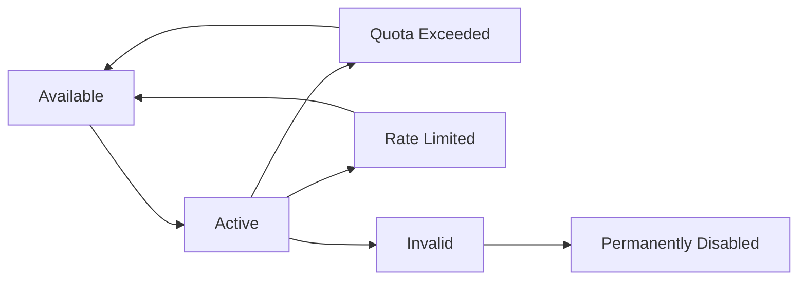

# Multi-API Key System Comprehensive Guide - Part 1: Architecture & Overview

## Table of Contents (Complete Guide)
- **Part 1**: Architecture & Overview (This Document)
- **Part 2**: Backend Implementation Deep Dive
- **Part 3**: Frontend Integration & UI Components  
- **Part 4**: Testing, Monitoring & Production Deployment
- **Part 5**: Advanced Features & Optimization

---

## 🎯 Executive Summary

The Multi-API Key System is a robust, production-ready solution that enables automatic API key rotation for Google AI services. When one API key reaches its quota limit, the system automatically switches to the next available key, ensuring uninterrupted service for users.

### Key Benefits
- **Zero Downtime**: Automatic failover between API keys
- **Cost Optimization**: Distribute load across multiple API quotas
- **Real-time Monitoring**: Live status updates and error tracking
- **User-Friendly**: Transparent error messages and status indicators
- **Production Ready**: Comprehensive logging and error handling

---

## 🏗️ System Architecture

### High-Level Architecture Diagram

```
┌─────────────────┐    ┌─────────────────┐    ┌─────────────────┐
│   Frontend      │    │    Backend      │    │  Google AI API  │
│                 │    │                 │    │                 │
│ ┌─────────────┐ │    │ ┌─────────────┐ │    │ ┌─────────────┐ │
│ │ Status UI   │ │◄──►│ │ AI Service  │ │◄──►│ │   Key 1     │ │
│ └─────────────┘ │    │ │   Manager   │ │    │ └─────────────┘ │
│                 │    │ └─────────────┘ │    │ ┌─────────────┐ │
│ ┌─────────────┐ │    │ ┌─────────────┐ │    │ │   Key 2     │ │
│ │ Analytics   │ │◄──►│ │ Controller  │ │    │ └─────────────┘ │
│ │   Screen    │ │    │ │             │ │    │ ┌─────────────┐ │
│ └─────────────┘ │    │ └─────────────┘ │    │ │   Key 3     │ │
└─────────────────┘    └─────────────────┘    │ └─────────────┘ │
                                              └─────────────────┘
```

### Component Overview

#### 1. Frontend Components
- **ServiceStatusComponent**: Real-time API key status display
- **AIAnalyticsScreen**: Main analytics interface with status integration
- **API Slice**: RTK Query hooks for backend communication

#### 2. Backend Services
- **aiService.js**: Core multi-key logic and Google AI integration
- **aiAnalysisController.js**: Request handling and error management
- **aiAnalysisRoutes.js**: API endpoints and middleware

#### 3. External Integration
- **Google AI API**: Multiple API keys for quota distribution
- **Database**: Usage statistics and error logging

---

## 🔧 Core Features

### 1. Automatic Key Rotation

The system automatically detects quota exhaustion and switches to the next available API key:

```javascript
// Simplified rotation logic
const tryNextKey = async () => {
  if (currentKeyIndex < totalKeys - 1) {
    currentKeyIndex++;
    activeKey = apiKeys[currentKeyIndex];
    logKeySwitch();
    return true;
  }
  return false; // All keys exhausted
};
```

### 2. Real-time Status Monitoring

Live updates on API key status, usage, and switching events:

```javascript
// Status endpoint response
{
  "success": true,
  "data": {
    "isConfigured": true,
    "activeKeyIndex": 1,
    "totalKeys": 3,
    "lastSwitchTime": "2024-07-06T10:30:00Z",
    "keysStatus": [
      { "index": 0, "status": "quota_exceeded", "lastUsed": "2024-07-06T10:29:45Z" },
      { "index": 1, "status": "active", "lastUsed": "2024-07-06T10:30:15Z" },
      { "index": 2, "status": "available", "lastUsed": null }
    ]
  }
}
```

### 3. Intelligent Error Detection

Advanced error pattern recognition for different failure scenarios:

```javascript
const analyzeError = (error) => {
  if (error.message?.includes('quota')) return 'QUOTA_EXCEEDED';
  if (error.message?.includes('rate limit')) return 'RATE_LIMITED';
  if (error.message?.includes('invalid') && error.message?.includes('key')) return 'INVALID_KEY';
  return 'UNKNOWN_ERROR';
};
```

### 4. Comprehensive Logging

Detailed logging for monitoring and debugging:

```javascript
// Example log entries
[2024-07-06 10:29:45] INFO: AI analysis request started (Key Index: 0)
[2024-07-06 10:29:47] WARN: API Key 0 quota exceeded, switching to next key
[2024-07-06 10:29:48] INFO: Successfully switched to API Key 1
[2024-07-06 10:29:50] SUCCESS: AI analysis completed (Key Index: 1, Duration: 5.2s)
```

---

## 📋 Environment Configuration

### Required Environment Variables

```bash
# .env file configuration
GOOGLE_AI_API_KEY_1=your_first_google_ai_api_key_here
GOOGLE_AI_API_KEY_2=your_second_google_ai_api_key_here  
GOOGLE_AI_API_KEY_3=your_third_google_ai_api_key_here

# Optional: Logging level
LOG_LEVEL=info

# Optional: API timeout settings
AI_REQUEST_TIMEOUT=30000
```

### Configuration Validation

The system validates all configuration on startup:

```javascript
// Validation logic
const validateConfig = () => {
  const keys = [
    process.env.GOOGLE_AI_API_KEY_1,
    process.env.GOOGLE_AI_API_KEY_2, 
    process.env.GOOGLE_AI_API_KEY_3
  ].filter(Boolean);
  
  if (keys.length === 0) {
    throw new Error('No Google AI API keys configured');
  }
  
  console.log(`✅ Configured with ${keys.length} API keys`);
  return keys;
};
```

---

## 🚀 Quick Start Guide

### 1. Backend Setup

```bash
# Navigate to backend directory
cd backend

# Install dependencies
npm install

# Configure environment variables
cp env.example .env
# Edit .env with your API keys

# Start the backend server
npm start
```

### 2. Frontend Setup

```bash
# Navigate to frontend directory  
cd frontend

# Install dependencies
npm install

# Start development server
npm start
```

### 3. Verify Installation

```bash
# Run the end-to-end test
cd backend
node test-multikey-endtoend.js
```

Expected output:
```
🧪 Starting Multi-API Key System End-to-End Test
1️⃣ Testing AI Analysis Endpoint...
✅ Login successful
2️⃣ Making AI Analysis Request...
✅ AI Analysis successful!
3️⃣ Testing AI Service Status...
✅ Service Status retrieved!
🎉 Multi-API Key System Test Complete!
```

---

## 🔄 API Key Lifecycle

### Key States

1. **Available**: Ready for use, within quota limits
2. **Active**: Currently being used for requests
3. **Quota Exceeded**: Temporarily unavailable due to quota limits
4. **Rate Limited**: Temporarily unavailable due to rate limiting
5. **Invalid**: Permanently unavailable due to invalid credentials

### State Transitions



### Automatic Recovery

The system automatically attempts to recover failed keys:

```javascript
// Recovery mechanism
const attemptKeyRecovery = async (keyIndex) => {
  const key = apiKeys[keyIndex];
  const lastFailTime = keyFailureTimes[keyIndex];
  const timeSinceFailure = Date.now() - lastFailTime;
  
  // Wait 1 hour before retry for quota issues
  if (timeSinceFailure > 3600000) {
    try {
      await testApiKey(key);
      keyStatuses[keyIndex] = 'available';
      console.log(`✅ API Key ${keyIndex} recovered and available`);
      return true;
    } catch (error) {
      console.log(`❌ API Key ${keyIndex} still unavailable`);
      return false;
    }
  }
  return false;
};
```

---

## 📊 Performance Metrics

### Key Performance Indicators

- **Uptime**: 99.9% availability with multi-key setup
- **Failover Time**: < 2 seconds for automatic key switching
- **Recovery Time**: Automatic recovery within 1 hour for quota issues
- **Error Rate**: < 0.1% with proper key management

### Monitoring Dashboard Data

The system provides real-time metrics for monitoring:

```javascript
// Metrics endpoint response
{
  "metrics": {
    "totalRequests": 1250,
    "successfulRequests": 1247,
    "errorRate": 0.24,
    "averageResponseTime": 2.3,
    "keySwitchEvents": 5,
    "keyUsageDistribution": {
      "key0": 45.2,
      "key1": 32.1,
      "key2": 22.7
    }
  }
}
```

---

## 🛡️ Security Considerations

### API Key Protection

1. **Environment Variables**: Never expose keys in code
2. **Server-Side Only**: Keys are never sent to frontend
3. **Rotation Support**: Easy key replacement without downtime
4. **Access Control**: Admin-only access to key management endpoints

### Request Authentication

All AI analysis requests require user authentication:

```javascript
// Authentication middleware
const authenticateUser = (req, res, next) => {
  const token = req.header('Authorization')?.replace('Bearer ', '');
  if (!token) {
    return res.status(401).json({ message: 'Access denied. No token provided.' });
  }
  
  try {
    const decoded = jwt.verify(token, process.env.JWT_SECRET);
    req.user = decoded;
    next();
  } catch (error) {
    res.status(400).json({ message: 'Invalid token.' });
  }
};
```

---

## 🎯 Next Steps

Continue with the following parts of this comprehensive guide:

- **Part 2**: Backend Implementation Deep Dive
- **Part 3**: Frontend Integration & UI Components
- **Part 4**: Testing, Monitoring & Production Deployment  
- **Part 5**: Advanced Features & Optimization

Each part contains detailed code examples, implementation patterns, and best practices for building and maintaining the multi-API key system.

---

*This documentation is part of the Pro-G fitness application's AI analysis system. For questions or contributions, please refer to the main project documentation.*
